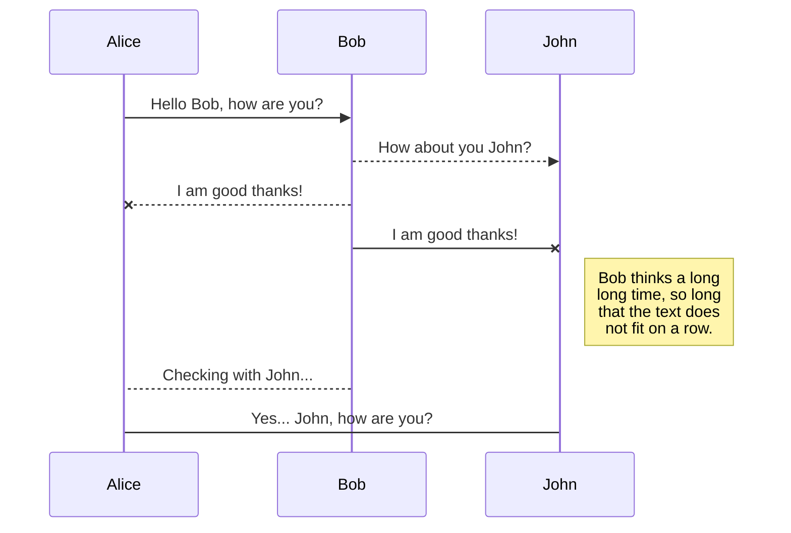
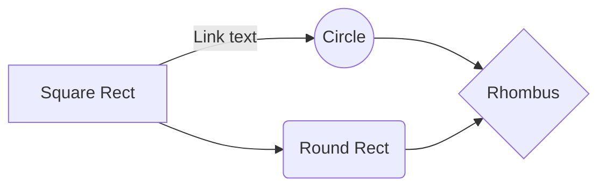

Website for train:

[website](https://jbt.github.io/markdown-editor)


[markdowntutorial.com](https://www.markdowntutorial.com)

[dillinger.io](https://dillinger.io)

[](https://nodesource.com/products/nsolid)


[site][df1]

[df1]: <http://daringfireball.net/projects/markdown/>


[site][df1]
[df1]: <http://daringfireball.net/projects/markdown/>


 [John Gruber]
 
 [john gruber]: <http://daringfireball.net>

# Heading 1
## Heading 2
### Heading 3
#### Heading 4
##### Heading 5
###### Heading 6

Note: There is space between # and string

*This is Italic* :    Note: There is no space between * and text.

_Tis is italic too_ :    Note: There is no space between _ and text.


**This is Bold** :    Note: There is no space between ** and text.

__This is Bold too__ :    Note: There is no space between __ and text.


<!-- Unordered list -->
With * + -

* One
* Two
    + 1
    * 2
    - 4
+ Three
- Four


<!-- Ordered list -->
With numbers and .

8. One
2. Two

    2. t1
    2. t2
    6. t3
8. Three 

    2. t1
    2. t2
    6. t3
9. Four


Note: There is a space line after parent number.

[Example](https://www.example.com)


`Text 0`

``Text 0``

```Text 0```

Text 1

```
def sum(a,b):
    return a + b;
```

```python
def sum(a,b):
    return a + b;
```

Support some Html tags:
<b>OK</b>
<i>ok</i>

```HTML
<b>OK</b>
<i>ok</i>
```

```
<b>OK</b>
<i>ok</i>
```

***BOLDITALIC***

> ok that is right. ok that is right. ok that is right. ok that is right. ok 
> that is right. ok that is right. ok that is right. ok that is right. ok that 
> is right. ok that is right. ok that is right. ok that is right. ok that is  right. ok that is right. ok that is right. ok that is right. ok that is
> > RRright. The overriding design goal for Markdown's
> formatting syntax is to make it as readable
>> as possible. The idea is that a

> Markdown-formatted document should be
> publishable as-is, as plain text, without
> looking like it's been marked up with tags
> or formatting instructions.

```sh
$ cd dillinger
$ npm install -d
$ node app
```


```pascal
var i: integer;
begin
for i:= 1 to 10 
    begin
        write(i);
    end
end
```


| Name | Age |
| ------ | ------ |
| John| 15 |
|sara| |20|
|Muler|45|
| Oliver |35|
| Mark | 25|


License
------

MIT

ok
---
ok


You can draw diagram with :
[link](https://mermaid-js.github.io/mermaid/)

## UML diagrams

You can render UML diagrams using [Mermaid](https://mermaidjs.github.io/). For example, this will produce a sequence diagram:



And this will produce a flow chart:

